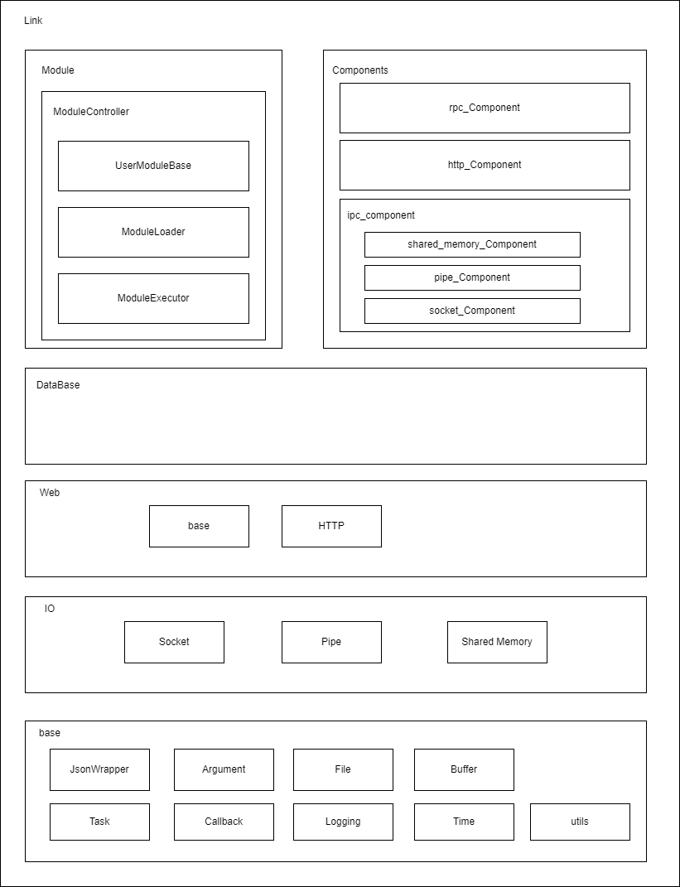

# nLink

## project in development

## micro service framework
Implement module based micro service framework.

## architecture

### nlink framework

### modlue

## todo

### Documents
  - Write architecture and design document
  - Write api document

### Build
  - Restruct CMake srtipt
  - Implement build structure by platform
### Implement
  - Fix some bug
  - Fix raw pointer to smart pointer on some implement

##### Base
  - Review whether Callback and Bind is absolutely necessary
  - Restruct task runner
  - Review structure of Logger
  - Implement some utility about Base64, GZIP, XML, etc...

##### Handle
  - Review whether Handle is absolutely necessary

##### Module
  - Fix memory leak when remove module
 
##### IO
  - ~~Remove ASIO~~
  - ~~Process pending write, read on socket~~
  - ~~Implement non copy callback, buffer on socket~~
  - ~~Restruct access using domain name~~
  - Implement TLS
  - Implement shared memory
  - Implement pipe, named pipe

##### Net
  - Restruct HTTP
  - Implement HTTP chunk stream
  - ~~Implement and restruct URI parser~~
  - Implement ORM

##### Component
  - ~~Adjust task runner~~
  - Implement shared memory IPC, pipe IPC component

##### Node
  - Implement middleware for module running

### Test
  - ~~Implement test envirnoment using google test~~
  - Implement test code
